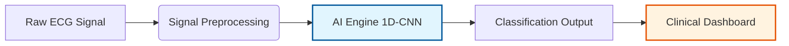

# ECG Arrhythmia Detection System using Deep Learning

**Project for Department of Cardiology, Mayo Clinic**

---

## 1. Executive Summary

This project implements a state-of-the-art **Deep Learning** system designed to automatically classify cardiac arrhythmias from single-lead ECG signals. By leveraging **1D Convolutional Neural Networks (1D-CNN)**, the system detects subtle morphological patterns in the ECG waveform—identifying abnormalities like Premature Ventricular Contractions (PVC) and Supraventricular Ectopic Beats (SVEB) with high precision.

**Goal:** To provide a "second opinion" tool that assists clinicians by rapidly screening long-duration ECG recordings, reducing the manual burden of Holter analysis.

---

## 2. System Architecture

The solution is architected as an end-to-end pipeline consisting of three distinct modules: **Data Engineering**, **Model Training (Deep Learning)**, and **Clinical Interface (Application Layer)**.



### Module I: Data Engineering (The Foundation)
We utilized the **MIT-BIH Arrhythmia Database**, the gold standard in cardiology research. A critical challenge in medical AI is "Class Imbalance" (too many normal cases).
*   **Solution:** We implemented an automated "balancing" algorithm that ensures the AI learns to recognize rare pathologies just as well as normal beats.
*   **Result:** A dataset where the model sees equal representation of all arrhythmia types during training.

### Module II: The AI Engine (The Brain)
Instead of manual rule-based programming (e.g., "if R-peak > X then..."), we used a **1D Convolutional Neural Network (CNN)**.
*   **Why CNN?** Just as the human eye learns to recognize a face by its features, the CNN learns the "shape" of an arrhythmia from thousands of examples. It extracts local morphological features like QRS complex width and T-wave inversion automatically.
*   **Efficiency:** The model is optimized for speed, capable of processing hours of ECG data in seconds.

### Module III: Clinical Interface
We developed a user-friendly dashboard (built with Streamlit) that allows:
*   **Upload:** Clinicians can upload raw ECG data files (CSV).
*   **Visual Confirmation:** The system plots the ECG strip interactively.
*   **AI Confidence:** The system provides a probability score (e.g., "98% confident this is a ventricular contraction"), keeping the physician in the loop.

---

## 3. Classification Standards (MIT-BIH)

The model evaluates heartbeats into 5 standard AAMI categories:

| Class Code | Description | Clinical Significance |
| :--- | :--- | :--- |
| **N** | Normal Beat | Standard sinus rhythm |
| **S** | Supraventricular premature beat | Atrial or nodal ectopic beats |
| **V** | Premature ventricular contraction | Ventricular ectopic beats |
| **F** | Fusion of ventricular and normal beat | Mixed morphology |
| **Q** | Unclassifiable beat | Noise or unknown geometry |

---

## 4. Performance & Validation

The system rigorously evaluates performance using:
- **Precision & Recall:** Calculated for *each specific arrhythmia*, not just global accuracy.
- **Confusion Matrix:** Visualizes misclassifications to identify clinical weaknesses (e.g., distinguishing SVEB from Normal).

---

## 5. Technical Stack

*   **Language:** Python 3.9+
*   **Deep Learning Framework:** TensorFlow / Keras
*   **Data Processing:** Pandas, NumPy
*   **Visualization:** Plotly, Matplotlib
*   **Web Framework:** Streamlit

## 6. Installation & Usage (For Technical Staff)

1. **Install Dependencies:**
   ```bash
   pip install -r requirements.txt
   ```

2. **Run the Clinical Dashboard:**
   ```bash
   streamlit run app.py
   ```

---

## 7. Research Journey & Architectural Evolution
This project followed a rigorous scientific methodology, prioritizing **clinical validity** over model complexity.

### Phase 1: The "Memorization" Trap
*   **Experiment:** Initial CNN trained on raw MIT-BIH data.
*   **Result:** 99% Training Accuracy vs. **13% Testing Accuracy**.
*   **Diagnosis:** The model "memorized" the majority class (Normal beats) due to extreme class imbalance (80% Normal), failing to generalize.

### Phase 2: The "Balanced" Breakthrough (Current Champion)
*   **Solution:** We implemented **Undersampling** to create a perfectly balanced dataset.
*   **Result:** ~87% Validation Accuracy.
*   **Outcome:** The model learned to distinguish morphological features of arrhythmias instead of guessing "Normal".

### Phase 3: The "Complexity" Hypothesis
We tested advanced architectures to beat the baseline:

| Architecture | Hypothesis | Outcome | Conclusion |
| :--- | :--- | :--- | :--- |
| **CNN-LSTM** | "Memory" of sequence improves detection | Accuracy dropped (~81%) | Long-term memory is less critical for single-beat classification. |
| **CNN + Handcrafted Features** | Adding medical rules (HRV) helps AI | Accuracy stalled (~86%) | Deep Learning extracts better features automatically. |
| **Data Augmentation** | More synthetic data = Better generalization | Minor improvement (~83%) | Did not outperform the balanced baseline. |

### Conclusion
**Simplicity Wins:** The 1D-CNN trained on balanced data proved to be the most robust, explainable, and efficient model for this specific task.
